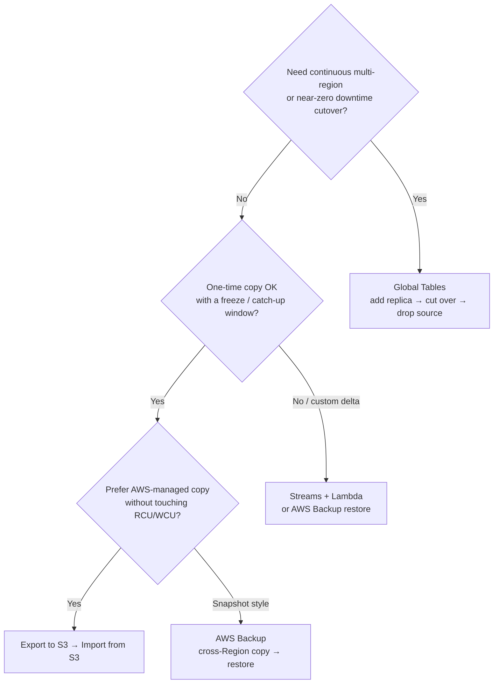
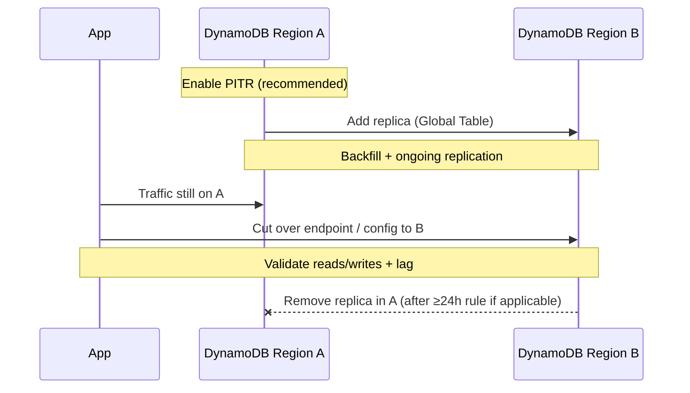
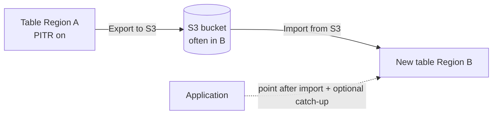

# 🌍 DynamoDB: migrate a table between AWS Regions
Reference guide for **moving Amazon DynamoDB data from Region A → Region B** with minimal risk. Pick the path by **downtime tolerance**, **whether you still need multi-region**, and **table size**.

> Related decision guide: [`rds-vs-aurora-vs-dynamodb/`](../rds-vs-aurora-vs-dynamodb/) (when DynamoDB is the right store).

## ⚡ Quick pick

| If you need… | Prefer |
| --- | --- |
| **Live migration**, large table, short cutover | **Global Tables** (add replica in destination, switch app, remove source) |
| **One-time** copy, no ongoing multi-region, no RCU hit on export | **Export to S3 → Import from S3** |
| Compliance / backup-centric restore into another Region | **AWS Backup** (copy recovery point → restore new table) |
| Custom transform, filter, or account hop with live catch-up | **Streams + Lambda** (or Glue) after a bulk seed |

## 📊 Options compared
| Criterion | **Global Tables** | **Export / Import (S3)** | **AWS Backup** | **Streams + Lambda** |
| --- | --- | --- | --- | --- |
| **Primary use** | Multi-region HA **or** live Region move | One-shot full copy | Restore / DR copy | Continuous delta sync |
| **Downtime** | Near-zero (app cutover only) | Freeze or accept lag unless you add catch-up | Usually offline / new table | Low if catch-up designed well |
| **Consumes source RCU** | Replication write path (dest WCUs); initial sync managed | **No** (export uses PITR snapshot) | No (backup APIs) | Yes (stream reads; writes on dest) |
| **Creates new table name?** | Same logical table; replica in new Region | **Yes** (import creates table) | **Yes** (restore creates table) | You create dest table |
| **Ongoing cost after** | Pay for **every** replica until removed | S3 + one-time import | Backup storage | Lambda + stream + dest WCUs |
| **Best for** | Prod cutover with sync already warm | Cold / planned copy, cross-account | DR runbooks | Custom pipelines |

## ✅ Recommended path A — Global Tables (live migration)
Use when the app must keep writing during the move and you can briefly run **two Regions** (or keep multi-region).

### Steps
1. **Inventory** the source table: PK/SK, GSIs/LSIs, TTL, streams, encryption (AWS-owned vs CMK), capacity mode, contributor insights, tags, IAM policies, and every **SDK region** / env var that points at the table.
2. Enable **Point-in-time recovery (PITR)** on the source (good practice before any migration).
3. Convert to a **global table** by **adding a replica** in Region B (console, CLI, or IaC). Prefer current Global Tables (2019.11.21+).
4. Wait until replica status is **Active** and item counts / spot checks look healthy. Watch CloudWatch replication metrics and throttling on both sides.
5. **Cut over the application** to Region B (config, Secrets Manager, Parameter Store, CI vars). Prefer a feature flag or dual-read validation first.
6. Keep Region A as replica only if you still want multi-region. Otherwise **remove the Region A replica** once traffic is stable.  
   > After enabling Global Tables, AWS may require waiting **~24 hours** before deleting the original replica—plan the decommission window.
7. Update alarms, dashboards, backups, and IaC so Region B is the source of truth. Turn off streams on B only if nothing else depends on them.

### Design notes
- **KMS:** customer-managed keys are **regional**. Plan a CMK in Region B (or AWS-owned keys) before adding the replica.
- **Consistency:** default Global Tables are **multi-region eventual** (last-writer-wins). Design for conflict-free keys or accept rare overwrites during dual-write windows—prefer **single-writer Region** during cutover.
- **IAM / VPC endpoints:** Gateway VPC endpoints and IAM conditions with `aws:RequestedRegion` must allow Region B.
- **DAX / Streams consumers:** recreate or re-point in the destination Region; they are not magically global.

## ✅ Recommended path B — Export to S3 → Import from S3 (one-time)
Use for a **planned copy** (same or different account), when you do **not** need continuous multi-region afterward. Export does **not** consume table RCU.

### Steps
1. Enable **PITR** on the source table (required for Export to S3).
2. Create an **S3 bucket** (commonly in Region B). Bucket policy / IAM must allow DynamoDB export from the source account/Region.
3. Run a **full export** to S3 (DynamoDB JSON + GZIP is the usual pair for import).
4. In Region B, **Import from S3** → creates a **new** table. Match compression (**GZIP**) and format (**DynamoDB JSON**). Choose keys, GSIs, and capacity as part of import settings.
5. Validate: item counts (approx), sample `GetItem`/`Query`, GSI queries, TTL attributes present.
6. If the source kept receiving writes after the export timestamp, either:
   - **freeze writes** for a short window and re-export, or
   - run a **Streams / CDC catch-up** until lag is zero, then cut over.
7. Point the app at the new table; decommission or archive the source when ready.

### Design notes
- Import **always creates a new table**; you cannot import into an existing one.
- Cross-account: export into the **destination account’s** bucket, then import there ([AWS docs — migrate between accounts via S3](https://docs.aws.amazon.com/amazondynamodb/latest/developerguide/bp-migrating-table-between-accounts-s3.html)).
- Large tables: export/import can take a long time; schedule capacity and monitoring, but the live table stays available during export.

## 🗂️ Path C — AWS Backup (DR-style)
1. Protect the table with **AWS Backup** (DynamoDB resource type).
2. Copy the recovery point to Region B (or use a backup plan with cross-Region copy).
3. **Restore** in Region B → **new table name**.
4. Re-create GSIs/settings as needed and cut over like path B.

Good fit when migration is framed as **restore from backup** rather than live replication. Native DynamoDB on-demand backups alone are **same-Region**; use AWS Backup (or S3 export) for cross-Region.

## 🔄 Path D — Streams + Lambda (custom catch-up)
1. Create the destination table (empty or seeded via export/import or backup restore).
2. Enable **DynamoDB Streams** (`NEW_AND_OLD_IMAGES` if you need deletes/updates).
3. Lambda (or OpenSearch-style consumer) in Region A or B writes `PutItem`/`DeleteItem` to Region B.
4. Cut over when stream lag ≈ 0; then disable the pipeline.

Use when you need **filtering**, **field transforms**, or a **controlled dual-write** window. Cost and idempotency are on you (`condition` expressions / idempotent keys).

## 📋 Cutover checklist
| # | Check |
| --- | --- |
| 1 | PK/SK and all **GSI/LSI** definitions match (or intentionally differ) |
| 2 | **TTL** attribute name preserved; confirm TTL enabled on dest |
| 3 | Encryption: CMK exists in **destination Region** |
| 4 | Capacity: on-demand vs provisioned; watch throttles on first traffic |
| 5 | App config: region, table name, IAM roles, VPC endpoints |
| 6 | Downstream: Streams → Lambda/Kinesis/EventBridge consumers re-homed |
| 7 | Alarms, budgets, Backup plans, IaC state updated to Region B |
| 8 | Rollback plan: keep source writable until validation window ends |

## ⚠️ Common pitfalls
- Treating Global Tables as “free DR” without budgeting **storage + replicated WCUs** in every Region.
- Dual-writing both Regions without a conflict strategy (eventual consistency).
- Forgetting that **restores and imports create new tables** (name change → app config).
- Leaving **IAM `aws:SourceVpce` / region conditions** that block Region B.
- Assuming **DAX**, local indexes consumers, or account-level SCPs automatically follow the move.
- Deleting the source replica **too early** (Global Tables cooldown / incomplete validation).

## 🧪 Validation ideas
- Compare approximate item counts and a hash sample of keys.
- Replay critical user journeys against Region B in a canary %.
- Chaos: kill Region A credentials in a staging env and confirm B-only path.
- Measure p99 latency from the app’s compute Region to the new table Region (locality matters).

## 📚 References
- [Global tables](https://docs.aws.amazon.com/amazondynamodb/latest/developerguide/GlobalTables.html)
- [Export to S3](https://docs.aws.amazon.com/amazondynamodb/latest/developerguide/S3DataExport.Requesting.html) · [Import from S3](https://docs.aws.amazon.com/amazondynamodb/latest/developerguide/S3DataImport.Requesting.html)
- [AWS Prescriptive Guidance — full table copy via S3](https://docs.aws.amazon.com/prescriptive-guidance/latest/dynamodb-full-table-copy-options/amazon-s3.html)
- [Restore / copy across Regions (re:Post)](https://repost.aws/knowledge-center/dynamodb-restore-cross-region)
- [Point-in-time recovery](https://docs.aws.amazon.com/amazondynamodb/latest/developerguide/PointInTimeRecovery.html)
